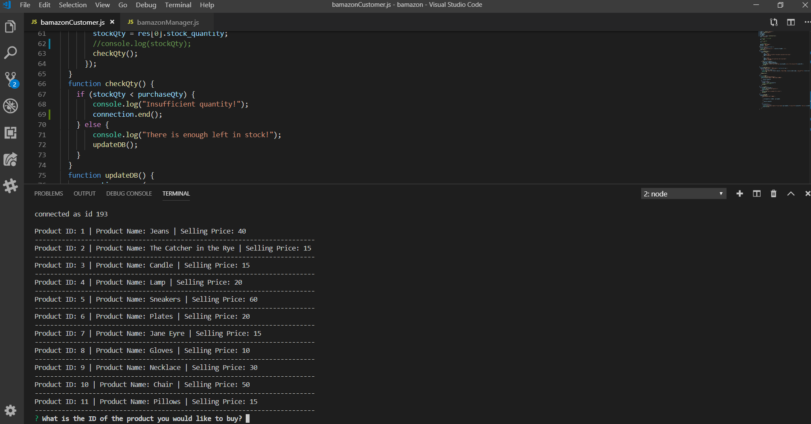

# bamazon

CUSTOMER APPLICATION
In this application, a customer is shown all available products for sale along with their inventories. They are then able to place an order for a product at which point the application checks the mySQL database containing all product information to check the quantity in stock. If there is sufficient quantity, the transaction is completed and the customer is shown the total cost of their transaction. If there is insufficient quantity in stock, the customer is told there is insufficient quantity on hand.

Below are images of this code being executed.

