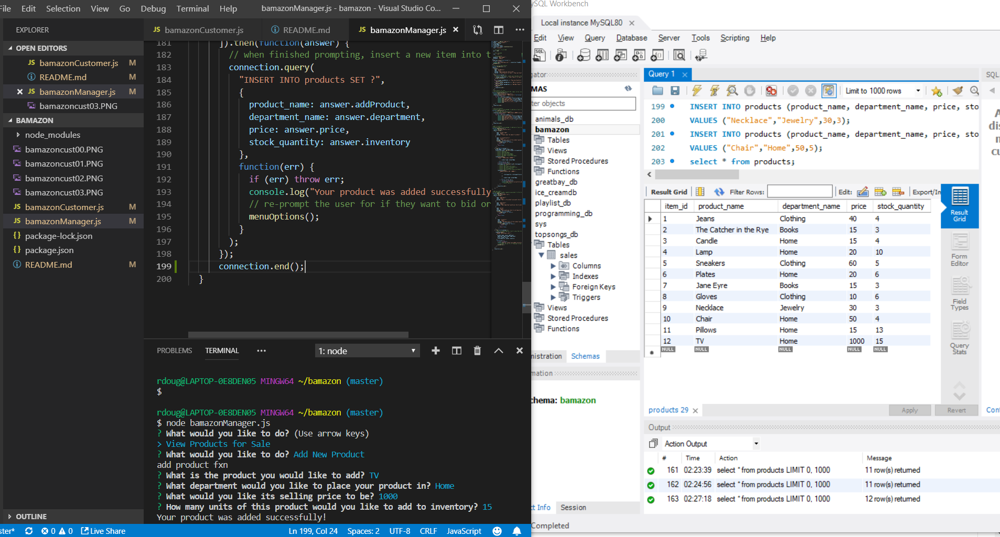

# bamazon

##Overview
In this server-side application, there are two programs that can run. The first is one catered to a customer accessing the bamazon store. The second is a manager accessing the bamazon store.

##Technologies
This is a node javascript program that uses mySQL to access and store the bamazon product  information and npm inquirer to prompt the users for what they would like to do.

##How it Works

CUSTOMER APPLICATION:
In this application, a customer is shown all available products for sale along with their inventories. They are then able to place an order for a product at which point the application checks the mySQL database containing all product information to check the quantity in stock. If there is sufficient quantity, the transaction is completed and the customer is shown the total cost of their transaction. If there is insufficient quantity in stock, the customer is told there is insufficient quantity on hand.

Below are images of this code being executed.

-----------------------------------------------------------

MANAGER APPLICATION:
In this application, a manager has the option to:
    1. View all products for sale
    2. View low inventory
    3. Add to inventory
    4. Add a New Product

    1. VIEW PRODUCTS FOR SALE
        When this function is chosen, all products stored in the mySQL database will be shown with their item IDs, names, prices, and inventory quantities. Execution is shown in the picture below.

    2. VIEW LOW INVENTORY
        When this function is chosen, all products whose inventories are less than 5 are returned. Execution is show below.

    3. ADD TO INVENTORY
        When this function is chosen, the manager is prompted to enter the ID of the product they would like to increase inventory on. They are then prompted to enter the amount they would like to add to the products inventory. If successful, the manager will receive a successful response and the product's inventory will be updated in the mySQL database. Execution is shown below.

    4. ADD A NEW PRODUCT
        When this function is chosen, the manager is able to add a new product to the database that does not already exist. The manager is asked for the product name, department, selling price, and inventory quantity. This information is then sent to and stored in the mySQL database along with an automatically generated unique ID. Execution is show below.

##Link to Deployed Site
https://rdougherty31.github.io/bamazon/